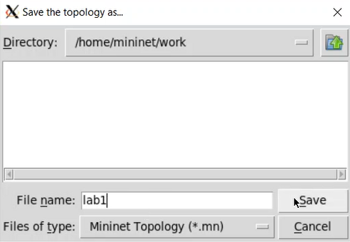

# Цель работы

Основной целью работы является развёртывание в системе виртуализации (например, в VirtualBox) 
mininet, знакомство с основными командами для работы с Mininet через командную строку и 
через графический интерфейс.

# Выполнение лабораторной работы

##  Настройка образа VirtualBox

Для начала перейдём в репозиторий Mininet и скачаем актуальный релиз ovf-образа виртуальной машины. 
После чего запустим систему виртуализации и импортируем файл .ovf. Перейдём в настройки системы 
виртуализации и уточним параметры настройки виртуальной машины. В частности, для VirtualBox выберем
импортированную виртуальную машину и перейдите в меню "Машина"-"Настроить". Перейдём к опции 
«Система». Внизу этого окна есть сообщение об обнаружении неправильных настроек, следуя рекомендациям, 
внесём исправления. В настройках сети первый адаптер должен иметь тип подключения host-only network adapter
(виртуальный адаптер хоста), который в дальнейшем мы будем использовать для входа в образ виртуальной машины. 
В этом режиме адаптер хоста использует специальное устройство vboxnet0, создает подсеть и назначает
IP-адрес сетевой карте гостевой операционной системы. Запустим виртуальную машину с Mininet (рис. [-@fig:001]):

[Установка и настройка виртуальной машины](image/1.png){ #fig:001 width=100% height=100% }

## Подключение к виртуальной машине

Залогинемся в виртуальной машине и посмотрим её адрес (рис. [-@fig:002]):

{ #fig:002 width=100% height=100% }

Внутренний адрес машины 192.168.56.102, подключимся к виртуальной машине (из терминала хостовой машины). 
Для отключения ssh-соединения с виртуальной машиной нажмём Ctrl + d (рис. [-@fig:003]):

{ #fig:003 width=100% height=100% }

## Работа с Mininet из-под Windows

Установим putty (рис. [-@fig:004]) и  VcXsrv Windows X Server (рис. [-@fig:005]):

{ #fig:004 width=100% height=100% }

{ #fig:005 width=100% height=100% }

Запустим Xserver. Выберем опции: multiple windows, display number: -1, start no client. Сохраним 
параметры, тогда при следующем запуске не нужно будет отмечать эти опции (рис. [-@fig:006]):

{ #fig:006 width=100% height=100% }

Запустим putty. При подключении добавим опцию перенаправления X11 (рис. [-@fig:007]):

{ #fig:007 width=100% height=100% }

## Настройка параметров XTerm

По умолчанию XTerm использует растровые шрифты малого кегля. Для увеличения размера шрифта и 
применения векторных шрифтов вместо растровых необходимо внести изменения в файл 
/etc/X11/app-defaults/XTerm и в конце файла добавить нужные строки. Перед этим установим 
текстовый редактор mcedit (рис. [-@fig:008]):

{ #fig:008 width=100% height=100% }

## Настройка соединения X11 для суперпользователя

При попытке запуска приложения из-под суперпользователя возникает ошибка. Ошибка возникает 
из-за того, что X-соединение выполняется от имени пользователя mininet, а приложение запускается 
от имени пользователя root с использованием sudo. Для исправления этой ситуации необходимо заполнить 
файл полномочий /root/ .Xauthority, используя утилиту xauth. Скопируем значение куки (MIT magic cookie)1 
пользователя mininet в файл для пользователя root (рис. [-@fig:009]):

{ #fig:009 width=100% height=100% }

## Работа с Mininet с помощью командной строки

Запустим минимальную топологию, состоящую из коммутатора, подключённого к двум хостам (рис. [-@fig:010]):

{ #fig:010 width=100% height=100% }

Для отображения списка команд интерфейса командной строки Mininet и примеров их использования 
введём команду: help (рис. [-@fig:011]):

{ #fig:011 width=100% height=100% }

Для отображения доступных узлов введём: nodes. Вывод этой команды показывает, что есть два хоста 
(хост h1 и хост h2) и коммутатор (s1) (рис. [-@fig:012]):

{ #fig:012 width=100% height=100% }

Иногда бывает полезно отобразить связи между устройствами в Mininet, чтобы понять топологию. 
Введём команду net в интерфейсе командной строки Mininet, чтобы просмотреть доступные линки (рис. [-@fig:013]):

{ #fig:013 width=100% height=100% }

Mininet позволяет выполнять команды на конкретном устройстве. Чтобы выполнить команду для 
определенного узла, необходимо сначала указать устройство, а затем команду (рис. [-@fig:014]):

{ #fig:014 width=100% height=100% }

По умолчанию узлам h1 и h2 назначаются IP-адреса 10.0.0.1/8 и 10.0.0.2/8 соответственно. 
Чтобы проверить связь между ними, мы можем использовать команду ping (рис. [-@fig:015]):

{ #fig:015 width=100% height=100% }

Очистим предыдущий экземпляр Mininet (рис. [-@fig:016]):

{ #fig:016 width=100% height=100% }

## Построение и эмуляция сети в Mininet с использованием графического интерфейса

Добавим два хоста и один коммутатор, соединим хосты с коммутатором (рис. [-@fig:017]). Настроим IP-адреса на 
хостах h1 и h2 (рис. [-@fig:018], [-@fig:019]):

{ #fig:017 width=100% height=100% }

{ #fig:018 width=100% height=100% }

{ #fig:019 width=100% height=100% }

Проверим соединение между хостами (рис. [-@fig:020]):

{ #fig:020 width=100% height=100% }

Проверим автоматическое назначение адресов (рис. [-@fig:021]):

{ #fig:021 width=100% height=100% }

Отобразим IP-адрес, назначенный хосту h1 (рис. [-@fig:022]):

{ #fig:022 width=100% height=100% }

Создадим каталог для работы с проектами mininet (рис. [-@fig:023]):

{ #fig:023 width=100% height=100% }

Сохраним топологию (рис. [-@fig:024]):

{ #fig:024 width=100% height=100% }

Изменим права доступа к файлам (рис. [-@fig:025]):

{ #fig:025 width=100% height=100% }
